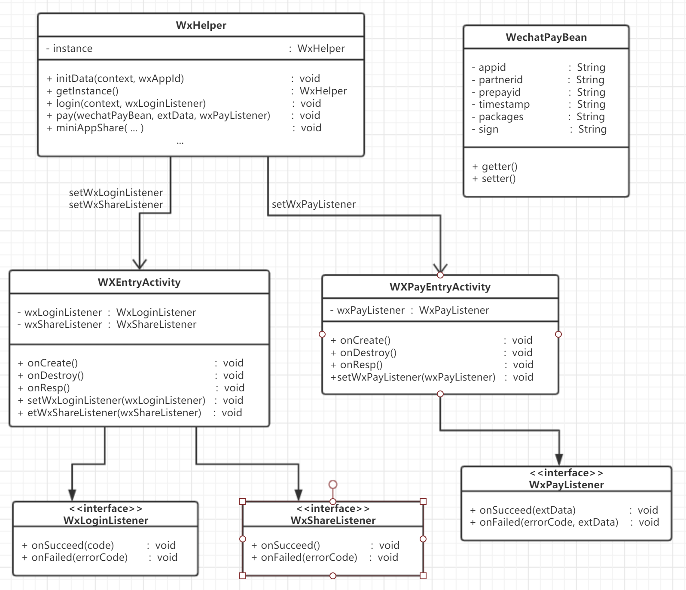

# WechatHelper

## 介绍：
### 对微信支付、登录、分享等一系列事件的封装，方便开辟新工程时快速部署微信相关

## 使用
### 在 build.gradle 中引用
```groovy
implementation 'io.goooler:wechathelper:1.0.0'
implementation 'com.tencent.mm.opensdk:wechat-sdk-android-without-mta:5.4.3'
```

## 摘要：
### 封装过程中使用了一个 activity-alias 方式将 WXEntryActivity 和 WXPayEntryActivity 这两个本来需要写入工程下特定路径的类重定向到库的路径下面，详细介绍见 [activity-alias](https://developer.android.com/guide/topics/manifest/activity-alias-element)
### WechatPayBean 根据公司内部业务做了定制，可自定义字段

```
<application
    android:allowBackup="true"
    android:largeHeap="true"
    android:supportsRtl="true">
    <activity
        android:name=".wxapi.WXEntryActivity"
        android:exported="true"
        android:launchMode="singleTop"
        android:theme="@android:style/Theme.Translucent" />
    <activity
        android:name=".wxapi.WXPayEntryActivity"
        android:exported="true"
        android:launchMode="singleTop"
        android:screenOrientation="portrait" />
    <activity-alias
        android:name="${applicationId}.wxapi.WXEntryActivity"
        android:exported="true"
        android:targetActivity=".wxapi.WXEntryActivity" />
    <activity-alias
        android:name="${applicationId}.wxapi.WXPayEntryActivity"
        android:exported="true"
        android:targetActivity=".wxapi.WXPayEntryActivity" />
</application>
```

## 类图：

